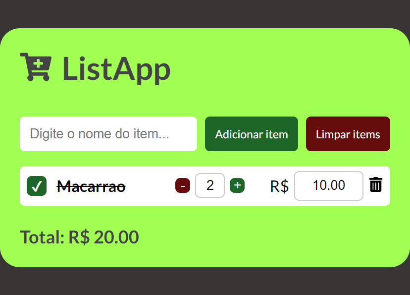

<h1 align="center">List App</h1>

  <a href="#-tecnologias">Tecnologias</a>&nbsp;&nbsp;&nbsp;|&nbsp;&nbsp;&nbsp;
  <a href="#-projeto">Projeto</a>&nbsp;&nbsp;&nbsp;|&nbsp;&nbsp;&nbsp;
  <a href="#memo-licença">Licença</a>

  

 

  

## 🚀 Tecnologias Utilizadas

Esse projeto foi desenvolvido com as seguintes tecnologias:

- React: Biblioteca JavaScript para a construção de interfaces de usuário.
- Styled-components: Biblioteca para estilização de componentes com suporte a CSS-in-JS.
- UUID: Geração de identificadores únicos.
- Framer Emotion: Biblioteca para animações no React.
- Keyframes: Módulo para criação de animações usando keyframes.

## 📑 Estrutura do Projeto

- A estrutura do projeto está organizada da seguinte forma:

- src/components: Componentes React reutilizáveis.

## 💻 Projeto

O List App é um aplicativo de lista de compras que simplifica a adição de itens. Além de inserir os itens, você pode especificar a quantidade e o valor individual. O total é calculado automaticamente à medida que você ajusta a quantidade.
<a href="https://list-app-blush.vercel.app/">Demo</a>

## ⚙️ Funcionalidades

- Adição de Itens: Permite adicionar itens à lista, incluindo quantidade e valor individual.
- Atualização Dinâmica: O total é recalculado instantaneamente ao ajustar a quantidade ou valor.
- Estilização Personalizada: Utiliza styled-components para uma experiência visual agradável.
- Identificadores Únicos: Usa UUID para garantir identificação única de cada item.

## ❣️ Contribuição

Sinta-se à vontade para contribuir com melhorias, correções de bugs ou novas funcionalidades. Abra uma issue para discutir ideias e sugestões, ou envie um pull request.

Esperamos que este aplicativo torne suas compras mais eficientes e organizadas. Se tiver alguma dúvida ou sugestão, não hesite em entrar em contato. Aproveite o uso!

## :memo: Licença

Esse projeto está sob a licença MIT.

---

Feito com ♥ by Gabriel Fellipe :wave:
